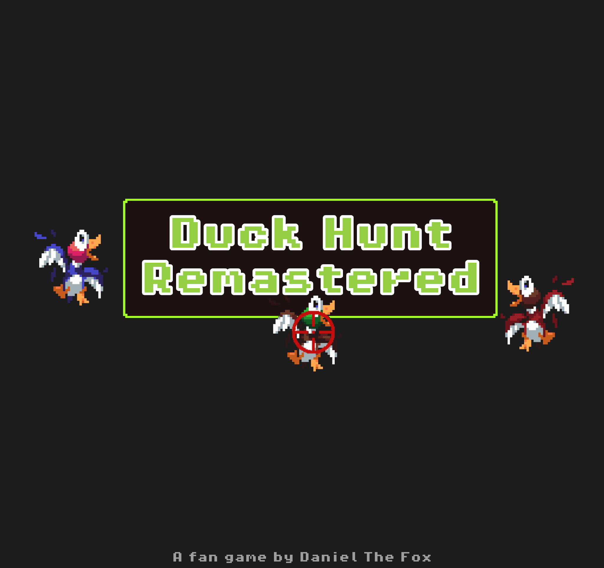
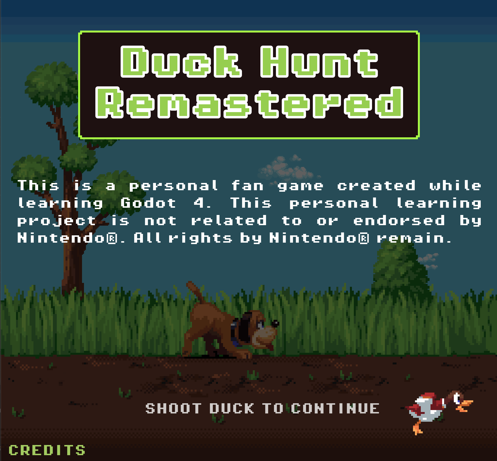
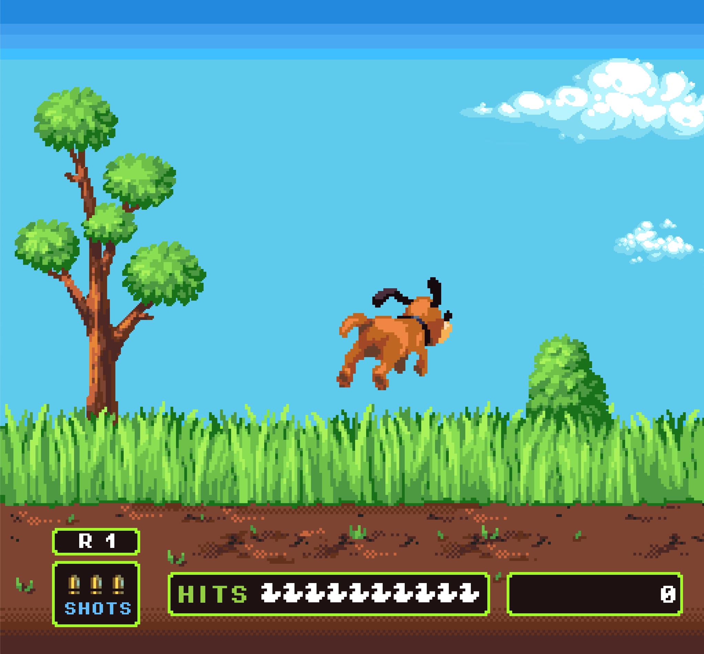
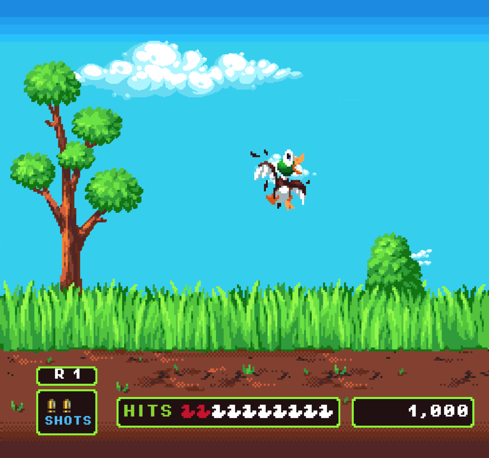
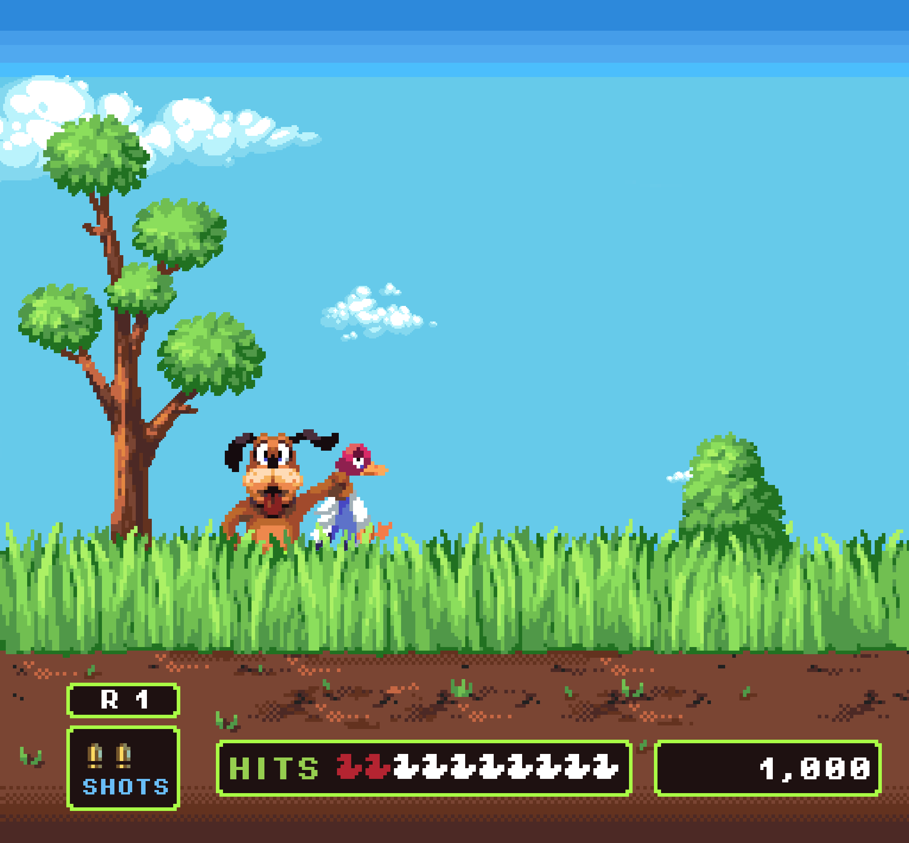
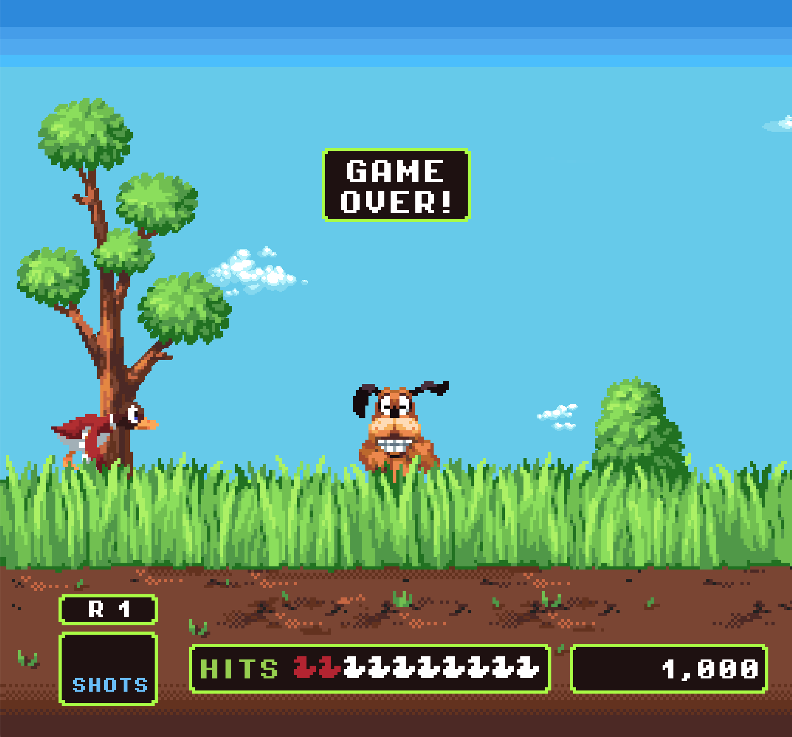

# 🦆 Duck Hunt Remastered 🦆
**🚀 A fan game created while learning Godot Engine 4 🚀**

## Content
- [About](#about)
- [How to play the game](#how-to-play-the-game)
- [Technical Restrictions](#technical-restrictions)
- [How is this Duck Hunt fan game different?!](#how-is-this-duck-hunt-fan-game-different)
- [Resources used](#resources-used)
- [Disclaimer](#disclaimer)
- [Third Party Licenses](#third-party-licenses)

## About

I created this fan game as a first project 
in order to learn how to develop games in the [Godot Engine](https://godotengine.org) :robot:.

If you don't know the Duck Hunt game, you can 
[read about the original NES game Duck Hunt on Wikipedia](https://en.wikipedia.org/wiki/Duck_Hunt) :book:.

You can also watch a 
[YouTube playthrough video of Duck Hunt](https://www.youtube.com/watch?v=Pd2AeH-P6r8) :movie_camera:
to get the idea.

Be sure to watch my [demo video of Duck Hunt Remastered on YouTube](https://youtu.be/rmo4hgRTLPo) :movie_camera: 
to see the game in action. :sunglasses:

Here are some screenshots of the game:













## How to play the game

I uploaded an HTML5-Export of the game to 
[itch.io](https://danielthefox.itch.io/duck-hunt-remastered), 
so that you can 
[play Duck Hunt Remastered in your web browser](https://danielthefox.itch.io/duck-hunt-remastered). :joystick::globe_with_meridians:

In addition, I uploaded 
[binary exports of the game for Mac OS, Windows and Linux](https://danielthefox.itch.io/duck-hunt-remastered) :joystick::computer:
to itch.io as well.

## Technical Restrictions

I encountered the following technical restrictions while testing the game in the following setups:

| Export Type      | OS  | Web Browser | Playable?    | Restrictions encountered |
| ---------------- | --- | ----------- | :----------: | ------------------------ |
| :globe_with_meridians: HTML5 on itch.io | :apple: MacOS 14.1 | Safari 17.1 | :white_check_mark: | You have to click once so that audio output is enabled. |
| :globe_with_meridians: HTML5 on itch.io | :apple: MacOS 14.1 | Chrome 119.0.6045.123 | :x: | Chrome freezes! :scream: |
| :globe_with_meridians: HTML5 on itch.io | :apple: MacOS 14.1 | Firefox 119.0.1 | :x: | Game freezes while loading! :scream: |
| :globe_with_meridians: HTML5 on itch.io | :penguin: Ubuntu 22.04.3 in VMWare Fusion 13.5.0 | Firefox 119.0.1 | :white_check_mark: | Cursor change on mouse hover on duck not working |
| :globe_with_meridians: HTML5 on itch.io | :window: Windows 11 Enterprise Evaluation, Build 22621 in VMWare Fusion 13.5.0 | Internet Explorer Edge 119.0.2151.58 | :white_check_mark: | Cursor middle part not visible in embedded iframe, working though when maximized |
| :globe_with_meridians: HTML5 on itch.io | :window: Windows 11 Enterprise Evaluation, Build 22621 in VMWare Fusion 13.5.0 | Firefox 119.0.1 | :x: | ```Error: The following features required to run Godot projects on the Web are missing: WebGL2 - Check web browser configuration and hardware support``` :cry: |
| :globe_with_meridians: HTML5 on itch.io | :window: Windows 11 Enterprise Evaluation, Build 22621 in VMWare Fusion 13.5.0 | Chrome 119.0.6045.124 | :white_check_mark: | Cursor middle part not visible in embedded iframe, working though when maximized |
| :penguin: Linux binary | Ubuntu 22.04.3 LTS in VMWare Fusion 13.5.0 | - | :white_check_mark: | Cursor change on mouse hover on duck not working |
| :apple: MacOS binary | MacOS 14.1 | - | :white_check_mark: | - |
| :window: Windows binary | Windows 11 Enterprise Evaluation, Build 22621 in VMWare Fusion 13.5.0 | - | :white_check_mark: | - |

While this is no 100% guarantee that the game functions on your setup,
it can give you a good indication.

Note: The SharedArrayBuffer support feature is activated on the game page on itch.io.

## How is this Duck Hunt fan game different?!

Fair question indeed and what started out as a spontaneous personal learning project 
that would never get shown to anybody, soon became a real passion for me. :heart:

I did research [other Duck Hunt fan games on itch.io](https://itch.io/search?q=Duck+Hunt), 
before deciding to upload my version of a Duck Hunt fan game. :duck:
Here's the points I identified that my game does differently in many cases:

* :joystick: Close to the original, but with a slight fresh touch, while sticking to the (S)NES style
* :sweat_smile: It's actually playable!
* :muscle: Playable in web browser (via itch.io) and downloadable as native binary for MacOS, Linux & Windows
* :teacher: GitHub repository including the source code of the game to learn from
* :movie_camera: Demo video & screenshots of game play
* :book: Detailed Readme
* :see_no_evil: Detailed comments and explanations in the source code, especially for pitfalls which some of cost me hours of debugging
* :robot: Created and working in Godot Engine version 4.1.3
* :notes: Background music & pond ambience sounds
* :cloud: Parallax clouds in the background
* :duck: Ducks can have 3 colors: blue, brown, red
* :dog2: Dog picks up the correctly colored shot duck
* :ear_of_rice: Intro animation in which the dog jumps behind the grass
* :dart: Animation for completing a round (shooting 10 ducks)
* :duck: Ducks shot scream and then fall behind grass
* :gun: Points appear where duck was shot
* :rocket: Duck flies out of grass from random X position
* :rofl: Dog laughs at you on game over
* :duck: Duck bounces of window boundaries and top edge of grass
* :smirk: The info boxes on the bottom part of the foreground are separate sprites which get scaled according to their content and on window resize (see Godot Engine docs on [NinePatchRect](https://docs.godotengine.org/en/stable/classes/class_ninepatchrect.html))
* :stopwatch: A timer shows time elapsed (mm:ss) since game start
* :dart: Local highscore stored in a text file in the user space for downloaded game versions
* :bust_in_silhouette: Random player name generator for highscore to keep it clean from profanity :stuck_out_tongue_winking_eye:
* :dart: Online highscore for game version played in web browser on itch.io

As this is my first game in Godot Engine, I'm really proud of how it turned out and what I was able to learn so far! :star_struck:

## Resources used
* [The Godot Engine](https://godotengine.org), Version 4.1.3 :robot:
* This project is inspired by the great
[Duck Hunt in Godot 4 tutorial video](https://www.youtube.com/watch?v=gLzwaMF8Zbk) and 
[example Duck Hunt project](https://github.com/16BitDev/duck-hunt/) by 
[16BitDev](https://www.youtube.com/@16bitdev) :heart:
* The
 [sprites for the animated ducks, animated dog, background & foreground](https://www.spriters-resource.com/custom_edited/duckhuntcustoms/sheet/63915/)
 are from Pik on spriters-resource.com. I did tweak them here and there a bit.
* The [pixel clouds](https://craftpix.net/freebies/free-clouds-pixel-art-asset-pack/) are from craftpix.net
* The [Pixel Operator font](https://fontlibrary.org/en/font/pixel-operator#Pixel%20Operator%20SC-Bold) is from fontlibrary.org
* The [crosshairs cursor](https://kenney.nl/assets/crosshair-pack) and [regenerate icon](https://kenney.nl/assets/input-prompts-pixel-16) are from kenney.nl
* All [sound effects and music](https://freesound.org) are from freesound.org
* I based the custom mouse cursor on the great 
[tutorial by Jon Topielski](https://www.youtube.com/watch?v=JrQ1-Ea6_KM). 
I had to make quite some changes though in order to get it to run in Godot Engine 4.
* The random player name generator is inspired by the [random container names in Docker](https://github.com/moby/moby/blob/master/pkg/namesgenerator/names-generator.go)
* The online highscore is powered by the great [SilentWolf backend services for Godot Engine](https://www.silentwolf.com)

## Disclaimer

This personal learning project is not related to or endorsed by Nintendo®️.
Use this personal project as is and at your own risk to have fun while playing it and to learn how to develop games with the 
[Godot Engine](https://godotengine.org). :robot:
No warranty and no official support are provided for this fan game project.

As this is a fan game, I have no commercial intent whatsoever regarding this project.

If you still want thank me somehow:

* :star: Leave a star for the [project's repository on GitHub](https://github.com/Daniel-The-Fox/duck-hunt-remastered)
* :+1: Like & comment my [demo video of Duck Hunt Remastered on YouTube](https://youtu.be/rmo4hgRTLPo)
* :sunglasses: Like & rate [Duck Hunt Remastered on itch.io](https://danielthefox.itch.io/duck-hunt-remastered)
* :joystick: Buy something great from Nintendo️®️, the originators of Duck Hunt
* :moneybag: Make a [donation to the Godot Engine project](https://fund.godotengine.org)
* :panda_face: Make a [donation to the WWF](https://www.worldwildlife.org) if you feel bad for shooting too many ducks :stuck_out_tongue_winking_eye:

## Third Party Licenses

See also [https://godotengine.org/license/](https://godotengine.org/license/)

------------------------------------------------

This game uses Godot Engine, available under the following license:

Copyright (c) 2014-present Godot Engine contributors. Copyright (c) 2007-2014 Juan Linietsky, Ariel Manzur.

Permission is hereby granted, free of charge, to any person obtaining a copy of this software and associated documentation files (the "Software"), to deal in the Software without restriction, including without limitation the rights to use, copy, modify, merge, publish, distribute, sublicense, and/or sell copies of the Software, and to permit persons to whom the Software is furnished to do so, subject to the following conditions:

The above copyright notice and this permission notice shall be included in all copies or substantial portions of the Software.

THE SOFTWARE IS PROVIDED "AS IS", WITHOUT WARRANTY OF ANY KIND, EXPRESS OR IMPLIED, INCLUDING BUT NOT LIMITED TO THE WARRANTIES OF MERCHANTABILITY, FITNESS FOR A PARTICULAR PURPOSE AND NONINFRINGEMENT. IN NO EVENT SHALL THE AUTHORS OR COPYRIGHT HOLDERS BE LIABLE FOR ANY CLAIM, DAMAGES OR OTHER LIABILITY, WHETHER IN AN ACTION OF CONTRACT, TORT OR OTHERWISE, ARISING FROM, OUT OF OR IN CONNECTION WITH THE SOFTWARE OR THE USE OR OTHER DEALINGS IN THE SOFTWARE.

------------------------------------------------

Godot uses FreeType to render fonts. Its license requires attribution, so the following text must be included together with the Godot license:

Portions of this software are copyright © 1996-2023 The FreeType Project (www.freetype.org). All rights reserved.

------------------------------------------------

Godot includes the ENet library to handle high-level multiplayer. ENet has similar licensing terms as Godot:

Copyright (c) 2002-2020 Lee Salzman

Permission is hereby granted, free of charge, to any person obtaining a copy of this software and associated documentation files (the "Software"), to deal in the Software without restriction, including without limitation the rights to use, copy, modify, merge, publish, distribute, sublicense, and/or sell copies of the Software, and to permit persons to whom the Software is furnished to do so, subject to the following conditions:

The above copyright notice and this permission notice shall be included in all copies or substantial portions of the Software.

THE SOFTWARE IS PROVIDED "AS IS", WITHOUT WARRANTY OF ANY KIND, EXPRESS OR IMPLIED, INCLUDING BUT NOT LIMITED TO THE WARRANTIES OF MERCHANTABILITY, FITNESS FOR A PARTICULAR PURPOSE AND NONINFRINGEMENT. IN NO EVENT SHALL THE AUTHORS OR COPYRIGHT HOLDERS BE LIABLE FOR ANY CLAIM, DAMAGES OR OTHER LIABILITY, WHETHER IN AN ACTION OF CONTRACT, TORT OR OTHERWISE, ARISING FROM, OUT OF OR IN CONNECTION WITH THE SOFTWARE OR THE USE OR OTHER DEALINGS IN THE SOFTWARE.

------------------------------------------------

If the project is exported with Godot 3.1 or later, it includes mbed TLS. The Apache license needs to be complied to by including the following text:

Copyright The Mbed TLS Contributors

Licensed under the Apache License, Version 2.0 (the "License"); you may not use this file except in compliance with the License. You may obtain a copy of the License at

http://www.apache.org/licenses/LICENSE-2.0

Unless required by applicable law or agreed to in writing, software distributed under the License is distributed on an "AS IS" BASIS, WITHOUT WARRANTIES OR CONDITIONS OF ANY KIND, either express or implied. See the License for the specific language governing permissions and limitations under the License.

------------------------------------------------

